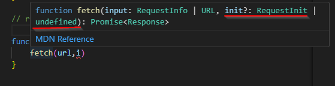

### Learning TypeScript by Building a small Application

> Key Points that I have learned in by building this project, I will add it here.


<details>
  <summary> 
  1. const getUsername = document.querySelector('#user') as HTMLInputElement;
 </summary>
    👆 This is called type Assertion 👆 
### Explaination

    Type Assertion in TypeScript is a mechanism that tells the compiler about the type of a variable¹. It allows you to set the type of a value and tell the compiler not to infer it¹. This is useful when you, as a programmer, might have a better understanding of the type of a variable than what TypeScript can infer on its own¹.

Here's an example of how you can use Type Assertion:

```javascript
let code: any = 123;
let employeeCode = <number> code;
console.log (typeof(employeeCode)); //Output: number
```

In the above example, we have a variable `code` of type `any`. We assign the value of this variable to another variable called `employeeCode`. However, we know that `code` is of type `number`, even though it has been declared as 'any'. So, while assigning `code` to `employeeCode`, we have asserted that `code` is of type `number` in this case, and we are certain about it. Now, the type of `employeeCode` is `number`¹.

There are two ways to do type assertion in TypeScript:

1. Using the angular bracket <> syntax¹.
2. Using `as` keyword¹.

It's important to note that unlike C# and Java, there is no runtime effect of type assertion in TypeScript. It is merely a way to let the TypeScript compiler know the type of a variable¹.

### Here are the links from where the info is collected.

(1) Type Assertion in TypeScript - TutorialsTeacher.com. https://www.tutorialsteacher.com/typescript/type-assertion.
(2) TypeScript Type Assertion - javatpoint. https://www.javatpoint.com/typescript-type-assertion.
(3) Explain Type Assertion TypeScript - Online Tutorials Library. https://www.tutorialspoint.com/what-is-type-assertion-in-typescript.
(4) Type Assertion in TypeScript - Scaler Topics. https://www.scaler.com/topics/typescript-type-assertion/.

</details>


<details>
<summary> 2. const formSubmit: HTMLFormElement | null = document.querySelector('.form')
 </summary>

 * We can use `as` but here as we are using `:HTMLFormElement | null` it is mandatory to use `null`.


</details>

<details>

<summary>3. Reusable Function</summary>

```Javascript
function myCustomfetcher(url: string,option?: RequestInit) {

    
}


function fetchUserData(user: string){
    myCustomfetcher(user,{})
}

// default fun call

fetchUserData("https://api.github.com/users");

```
1. So in this part `function myCustomfetcher(url: string,option?: RequestInit)`, we will just do we will not going to define `option: RequestInit` at the begining.
2. What we will do is that 👇.

```Javascript
 function myCustomfetcher(url: string,option?:) {

 fetch(url,i)
 
 // So in here we will hover in the fetch(url,i) and from there
 // we will get the option of adding Request init.
    
}

```



> The above picture 👆 is the example of how you can use it.

</details>


<details>
<Summary>4. How to use Generics </Summary>

``` JavaScript

function myCustomfetcher<T> (url: string,option?: RequestInit):Promise<T> { //<> is the generic
    
}


function fetchUserData(user: string){
    myCustomfetcher<UserData[]>(user,{})
    //<UserData[]> we know that our api will give array of objects
}

// default fun call

fetchUserData("https://api.github.com/users");

```


</details>

<details>
<Summary>5. Using throw new Error() </Summary>

`throw new Error()` in JavaScript does stop the execution of the current function. The statements after `throw new Error()` won't be executed, and control will be passed to the first `catch` block in the call stack. If no `catch` block exists among caller functions, the program will terminate¹². 

Here's an example:

```javascript
function exampleFunction() {
  console.log('This will run');
  throw new Error('An error occurred');
  console.log('This will not run');
}

try {
  exampleFunction();
} catch (error) {
  console.error(error.message);
}
```

In this code, 'This will run' will be logged to the console, but 'This will not run' will not, because the function's execution is stopped by the `throw new Error()` statement¹².

### Usefull Links from where the data is collected
(1) throw - JavaScript | MDN - MDN Web Docs. https://developer.mozilla.org/en-US/docs/Web/JavaScript/Reference/Statements/throw.
(2) Does the throw new error act as a return in Javascript- Question. https://stackoverflow.com/questions/73872002/does-the-throw-new-error-act-as-a-return-in-javascript-question.
(3) Handling Errors in JavaScript: The Definitive Guide. https://levelup.gitconnected.com/the-definite-guide-to-handling-errors-gracefully-in-javascript-58424d9c60e6.


</details>

<details>
<summary>6. What is insertAdjacentHTML() ?</summary>

The `insertAdjacentHTML()` method in JavaScript is a part of the Element interface, which means it can be invoked from any HTML element²⁴. This method parses a given text as HTML or XML and inserts the resulting nodes into the DOM tree at a specified position².

Here's the syntax for `insertAdjacentHTML()`:

```javascript
element.insertAdjacentHTML(position, text);
```

- `position`: A string representing the position relative to the element. It must be one of the following strings²:
  - `"beforebegin"`: Before the element itself.
  - `"afterbegin"`: Just inside the element, before its first child.
  - `"beforeend"`: Just inside the element, after its last child.
  - `"afterend"`: After the element itself.
- `text`: The string to be parsed as HTML or XML and inserted into the tree².

Here's an example:

```javascript
let p = document.createElement('p');
p.insertAdjacentHTML('afterbegin', '<span>Hello</span>');
console.log(p.outerHTML); // <p><span>Hello</span></p>
```

In this example, a new `<span>` element with the text 'Hello' is inserted at the beginning of the `<p>` element¹².

Please note that when inserting HTML into a page by using `insertAdjacentHTML()`, be careful not to use user input that hasn't been escaped. You should not use `insertAdjacentHTML()` when inserting plain text. Instead, use the `Node.textContent` property or the `Element.insertAdjacentText()` method. This doesn't interpret the passed content as HTML, but instead inserts it as raw text².

### Usefull Links from where the data is collected

(1) Element: insertAdjacentHTML() method - Web APIs | MDN. https://developer.mozilla.org/en-US/docs/Web/API/Element/insertAdjacentHTML.
(2) JavaScript insertAdjacentHTML - JavaScript Tutorial. https://www.javascripttutorial.net/javascript-dom/javascript-insertadjacenthtml/.
(3) HTML DOM Element insertAdjacentHTML() Method - W3Schools. https://www.w3schools.com/jsref/met_node_insertadjacenthtml.asp.
(4) HTML DOM insertAdjacentHTML() Method - GeeksforGeeks. https://www.geeksforgeeks.org/html-dom-insertadjacenthtml-method/.
(5) JavaScript insertAdjacentHTML() method - javatpoint. https://www.javatpoint.com/javascript-insertadjacenthtml-method.

</details>